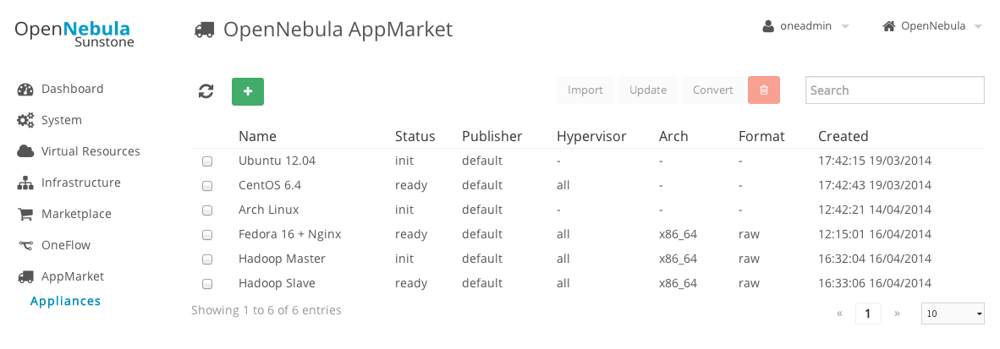

# AppMarket

## Description

AppMarket allows you to build your own internal marketplace service. Your OpenNebula users will be able to import the appliances from your internal AppMarket service to their OpenNebula instance through a new Sunstone tab called AppMarket, reducing the time needed to jumpstart a OpenNebula deployment and also making it possible to quickly incorporate new services to the cloud offering.

An OpenNebula Virtual Appliance is a pre-built software solution, consisting of a set of pre-configured virtual machine images and a template, ready-to-run on an OpenNebula cloud. The Marketplace contains metadata that defines the Virtual Appliance but not the appliance files themselves. The metadata includes the links to download the appliance files from third-party servers.

After deploying the AppMarket server, users will be able to access the AppMarket functionality through its GUI, pointing the web browser to the url where the server is running; or through the CLI, using the appmarket* commands.

The [OpenNebula Marketplace](http://marketplace.c12g.com/appliance) is an example of an AppMarket deployment currently running and publicly accessible for the OpenNebula community, every OpenNebula installation is ready to interact with this marketplace, through the Marketplace tab in Sunstone.

In AppMarket 2.0 a new component is included, [AppMarket Worker](doc/appmarket_worker_installation_and_configuration.md). This new component allows you to create an appliance from an OVA file. The worker will download and unpackage the OVA file, and will generate the URLs for the files. With this information a new appliance will be created containing the files and the OpenNebula template representing the service.

## Authors

* Leader: Daniel Molina Aranda dmolina@opennebula.org
* Jaime Melis jmelis@opennebula.org

## Acknowledgements

The new features introduced in the AppMarket 2.0 were funded by [Produban](http://www.produban.com/) in the context of the Fund a Feature Program.

## Features

* Build your own marketplace
* Share virtual appliances across several OpenNebula instances
* Distribute internally developed virtual appliances
* Provide appliances from a catalog and portal
* Tight integration with OpenNebula

* Appliances can define multiple files and an OpenNebula template
* Appliances can be created from an OVA file
* Appliances can be converted to different formats (raw, qcow2, vmdk, vdi)
* Appliances can be grouped in catalogs

## Releases

### AppMarket 1.9.80 Beta

[Release Notes 1.9.80](doc/release_notes/appmarket-1.9.80.md)

### AppMarket 1.9.85 RC

[Release Notes 1.9.85](doc/release_notes/appmarket-1.9.85.md)

### AppMarket 1.9.90 RC 2

[Release Notes 1.9.90](doc/release_notes/appmarket-1.9.90.md)

## Compatibility

This add-on is compatible with OpenNebula 4.x, but the new features included in AppMarket 2.0 are only available interacting with AppMarket from an OpenNebula 4.6 deployment

## Installation & Configuration
[More info](doc/installation_and_configuration.md)

## Usage
[More info](doc/usage.md)

## AppMarket Worker Installation and Configuration
[More info](doc/appmarket_worker_installation_and_configuration.md)

## Development

To contribute bug patches or new features, you can use the github Pull Request model. It is assumed that code and documentation are contributed under the Apache License 2.0.

More info:
* [How to Contribute](http://opennebula.org/software:add-ons#how_to_contribute_to_an_existing_add-on)
* Support: [OpenNebula user mailing list](http://opennebula.org/community:mailinglists)
* Development: [OpenNebula developers mailing list](http://opennebula.org/community:mailinglists)
* Issues Tracking: Github issues
