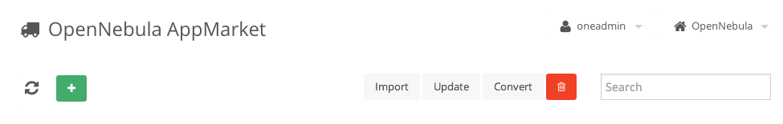

AppMarket Installation and Configuration
========================================

Requirements
------------

AppMarket requires:

* [MongoDB](http://www.mongodb.org/display/DOCS/Quickstart)
* ruby and rubygems installed.
* ''opennebula-common'' package.

If you want to create appliances from an OVA file or convert the format of the appliance you will need to configure at least one AppMarket Worker.

Install AppMarket
-----------------

The AppMarket Worker requires the OpenNebula ''opennebula-common'' package. This packages installs the ''oneadmin'' user. Please [install the opennebula-common package](http://docs.opennebula.org/4.8/design_and_installation/building_your_cloud/ignc.html) before moving on.

AppMarket packages can be download from the [OpenNebula Downloads](http://downloads.opennebula.org/packages/appmarket-2.0.3/) page in two formats:

* rpm package
* deb package

The rpm and deb packages can be installed with ''dpkg'' and ''rpm'' respectively:

    # Debian/Ubuntu
    sudo dpkg -i appmarket_*.deb

    # CentOS/openSUSE
    sudo yum localinstall appmarket_*.rpm

If installing from source code you can run the following command:

    ./install.sh -h

The following commands are necessary in any of the previous cases to install the required gems

* bundler. To install it you can issue as root:

        gem install bundler

* Required gems. To install the gems needed by AppMarket do this as root:

        cd /usr/lib/one/ruby/oneapps/market
        bundle install

        gem 'json'
        gem 'haml'
        gem 'sinatra'
        gem 'mongo'
        gem 'bson_ext'
        gem 'rspec'
        gem 'rack-test'
        gem 'redcarpet'
        gem 'mail'
        gem 'bcrypt-ruby'
        gem 'opennebula-cli'

Upgrade AppMarket
-----------------

This section is a quick go-to reference for upgrading the AppMarket version. Note that it includes commands relative to AppMarket Worker upgrade. Do **not** run the AppMarket Worker commands if you aren't upgrading the Worker node.

Download the packages (details in previous section)

Stop the Services

    $ appmarket-server stop
    $ appconverter-worker stop

Verify that the services stopped coorectly:

    $ ps -ef | grep appmarket-server
    $ ps -ef | grep appconverter-worker

Backup /etc directory

    $ tar cvzf etc-one.tar.gz /etc/one
    $ cp /etc/one/sunstone-appmarket.conf  sunstone-appmarket.conf.pre-upgrade
    $ cp /etc/one/appconverter-worker.conf appconverter-worker.conf.pre-upgrade

Backup Mongo Database

    $ mongodump -d market

Install Packages

    $ sudo dpkg -i appmarket_*.rpm

Install Gems

    $ cd /usr/lib/one/ruby/oneapps/market; bundle install
    $ cd /usr/lib/one/ruby/appconverter/; bundle install

Review and upgrade configuration files

    $ diff -u sunstone-appmarket.conf.pre-upgrade /etc/one/sunstone-appmarket.conf
    $ sudo vi /etc/one/sunstone-appmarket.conf
    $ diff -u appconverter-worker.conf.pre-upgrade /etc/one/appconverter-worker.conf
    $ sudo vi /etc/one/appconverter-worker.conf
    $ diff -u appmarket-server.conf.pre-upgrade /etc/one/appmarket-server.conf
    $ sudo vi /etc/one/appmarket-server.conf

Database Upgrade

    $ appmarket-db

Start the Services

    # /etc/init.d/opennebula-appmarket start
    # /etc/init.d/opennebula-appconverter-worker start

Configure AppMarket
-------------------

The AppMarket configuration file can be found at */etc/one/appmarket-server.conf*. It uses YAML syntax and the following parameters can be configured in this file

### MongoDB endpoint

AppMarket requires a MongoDB database to store the appliances and users metadata. For more information on how to install and configure MongoDB please use [the official webpage](http://www.mongodb.org/display/DOCS/Quickstart).

The host and port where the MongoDB is running can be defined as follows:

    # MongoDB endpoint
    db_host: localhost
    db_port: 27017

### AppMarket server endpoint

The host and port where the AppMarket server will run is defined as follows. By default the server runs locally in port 6242.

    # Host and port where AppMarket server will run
    :host: 127.0.0.1
    :port: 6242

### Bootstrap

The first time the AppMarket server is started, the DB will be initialized and an admin user will be created using the information provided in the appmarket-server.conf.

    # Admin credentials. This will be the user that will be used in the
    #   bootstrap process the first time the server is started
    user:
        organization:   default
        first_name:     default
        last_name:      default
        username:       default
        password:       default
        website:        default
        email:          default

Start AppMarket
---------------

To start and stop the server, use the ''opennebula-appmarket-server'' command:

    # /etc/init.d/opennebula-appmarket start

> By default, the server will only listen to requests coming from localhost. Change the *host* attribute in */etc/one/appmarket-server.conf* to your server public IP, or 0.0.0.0 so appmarket will listen on any interface.

Inside */var/log/one/* you will find new log files for the server.

    /var/log/one/appmarket-server.error
    /var/log/one/appmarket-server.log

Enabling the Sunstone Tabs
--------------------------

The AppMarket tabs are not included in sunstone by default. To enable them, edit */etc/one/sunstone-views.yaml* and include the AppMarket tabs

* */etc/one/sunstone-views.yaml*

        ...
        available_tabs:
            - dashboard-tab
            ...

            - apptools-appmarket-dashboard
            - apptools-appmarket-appliances

Also include the appmarket in the routes section of */etc/one/sunstone-server.conf*

* */etc/one/sunstone-server.conf*

        ...
        routes:
        ...
            - appmarket

Also edit */etc/one/sunstone-views/admin.yaml* and */etc/one/sunstone-views/user.yaml* and add  the Appmarket tabs inside *enabled_tabs*:

* */etc/one/sunstone-views/admin.yaml* and */etc/one/sunstone-views/user.yaml*

        enabled_tabs:
            dashboard-tab: true

            ...

            apptools-appmarket-dashboard: true
            apptools-appmarket-appliances: true

And the corresponding sections for the tabs at the end of the file. These tabs are configurable and can be adapted depending on the kind of user that is interacting with the AppMarket. These are the two options that we propose as an example, one for the admin of the marketplace and another one for regular users.

### Admin View /etc/one/sunstone-views/admin.yaml

The admin will be able to:

* List all the appliances even those that are not in ready state
* Create appliances
* Convert appliances
* Delete appliances
* Import appliances into OpenNebula from Sunstone

Yaml /etc/one/sunstone-views/admin.yaml:

        # BOTTOM OF FILE
        apptools-appmarket-dashboard:
            panel_tabs:
            table_columns:
            actions:
        apptools-appmarket-appliances:
            panel_tabs:
                appmarketplace_info_tab: true
                appmarketplace_jobs_tab: true
                appmarketplace_template_tab: true
            panel_tabs_actions:
                appmarketplace_jobs_tab:
                    Job.del: true
            table_columns:
                - 0         # Checkbox
                #- 1         # ID
                - 2         # Name
                - 3         # Status
                - 4         # Publisher
                - 5         # Hypervisor
                - 6         # Arch
                - 7         # Format
                #- 8         # Tags
                - 9         # Created
            actions:
                AppMarket.refresh: true
                AppMarket.import: true
                AppMarket.delete: true
                AppMarket.convert: true
                AppMarket.create_dialog: true

### User View /etc/one/sunstone-views/user.yaml

The user will be able to:

* List the appliances in ready state
* Import appliances into OpenNebula from Sunstone

Yaml /etc/one/sunstone-views/user.yaml:

        # BOTTOM OF FILE
        apptools-appmarket-dashboard:
            panel_tabs:
            table_columns:
            actions:
        apptools-appmarket-appliances:
            panel_tabs:
                appmarketplace_info_tab: true
                appmarketplace_jobs_tab: false
                appmarketplace_template_tab: true
            panel_tabs_actions:
                appmarketplace_jobs_tab:
                    Job.del: false
            table_columns:
                - 0         # Checkbox
                #- 1         # ID
                - 2         # Name
                #- 3         # Status
                - 4         # Publisher
                - 5         # Hypervisor
                - 6         # Arch
                - 7         # Format
                #- 8         # Tags
                - 9         # Created
            actions:
                AppMarket.refresh: true
                AppMarket.import: true
                AppMarket.delete: false
                AppMarket.convert: false
                AppMarket.create_dialog: false

For more information on how to customize the views based on the user/group interacting with Sunstone check the [sunstone views guide](http://opennebula.org/documentation:rel4.2:suns_views)

### Credentials

The user that interacts with the AppMarket does not correspond with the OpenNebula user, so you have to use an AppMarket account if you want to gain admin privileges or access custom appliance catalogs associated with a given user. This user account can be defined for **all the users of Sunstone** in the **/etc/one/sunstone-appmarket.conf**

    # AppMarket username and password
    # If no credentials are provided, an anonymous client will be used

    :appmarket_username:
    :appmarket_password:

Or you can define a **different account for each user** adding the APPMARKET_USER and APPMARKET_PASSWORD in the template of the user. This can be achieved from the settings dialog of Sunstone or using the oneuser command from the CLI.

If no account is provided in any of the two options, an annonymous account will be used and only the appliances in the community catalog (this is the catalog where the appliances are created by default) will be accessible.

It is recommended to use a special account for the oneadmin user with admin privileges in the AppMarket and another one for the rest of the users with restricted privileges, for example the annonymous account.

### Endpoint

In the **/etc/one/sunstone-appmarket.conf** you can define the url of AppMarket

    # AppMarket endpoint
    #
    :appmarket_url: http://localhost:6242

Note that the url is defined in sunstone-appmarket.conf and not in sunstone-server.conf. Be sure to restart Sunstone for the changes to take effect.

