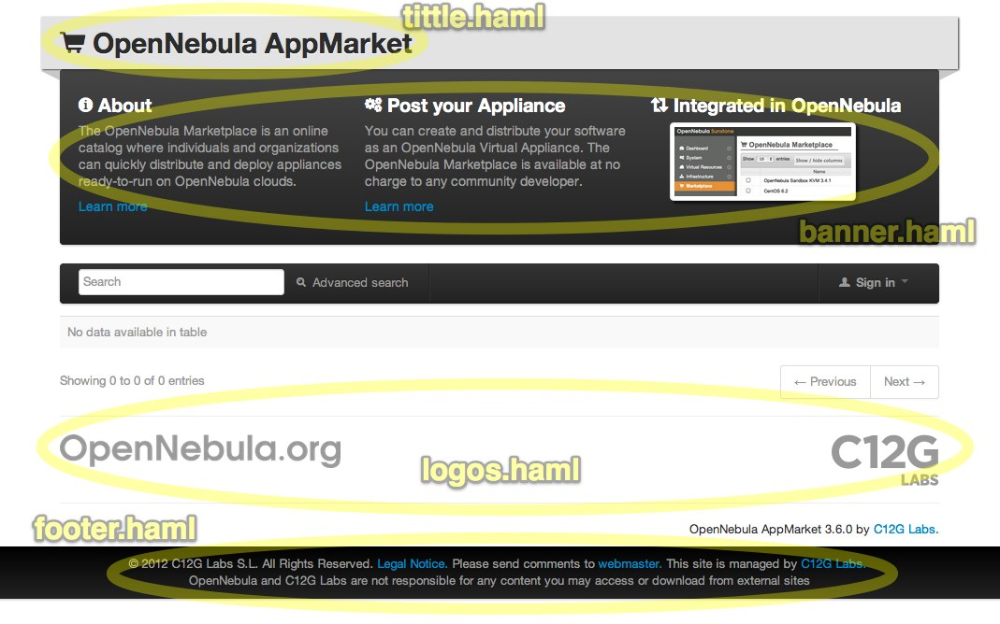
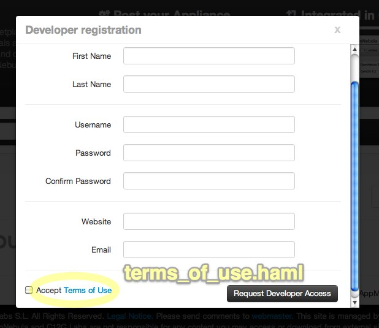

AppMarket Installation and Configuration
========================================

[TOC]

Requirements
------------

AppMarket requires:

* [MongoDB](http://www.mongodb.org/display/DOCS/Quickstart)
* ruby and rubygems installed.
* bundler. To install it you can issue as root:
```
    gem install bundler
```
* Required gems. To install the gems needed by AppMarket do this as root:
```
    cd /usr/lib/one/ruby/oneapps/market
    bundle install
```

Install AppMarket
-----------------

AppMarket can be download from the [OpenNebula Downloads](http://downloads.opennebula.org/) page in three formats:

* tarball
* rpm package
* deb package

The rpm and deb packages can be installed with ''dpkg'' and ''rpm'' respectively:

    # Debian/Ubuntu
    sudo dpkg -i appmarket_4.2.0.deb

    # CentOS/openSUSE
    sudo rpm -i appmarket_4.2.0.rom


If installing from source code you can run the following command:

    ./install.sh -h


Configure AppMarket
-------------------

The AppMarket configuration file can be found at */etc/one/appmarket-server.conf*. It uses YAML syntax and the following parameters can be configured in this file

### MongoDB endpoint

AppMarket requires a MongoDB database to store the appliances and users metadata. For more information on how to install and configure MongoDB please use [the official webpage](http://www.mongodb.org/display/DOCS/Quickstart).

The host and port where the MongoDB is running can be defined as follows:

    # MongoDB endpoint
    db_host: localhost
    db_port: 27017

### AppMarket server endpoint

The host and port where the AppMarket server will run is defined as follows. By default the server runs locally in port 6242.

    # Host and port where AppMarket server will run
    :host: 127.0.0.1
    :port: 6242


### Bootstrap

The first time the AppMarket server is started, the DB will be initialized and an admin user will be created using the information provided in the appmarket-server.conf.

    # Admin credentials. This will be the user that will be used in the
    #   bootstrap process the first time the server is started
    user:
        organization:   default
        first_name:     default
        last_name:      default
        username:       default
        password:       default
        website:        default
        email:          default

### Mail

A mail service can be configured to send a notification to the user when her account is activated. By default this service is disabled.

    # Parameters that will be used to configure the delivery method of the
    #   mail service. More information: http://rubygems.org/gems/mail
    mail:
        :address:              mail.default.com
        :port:                 587
        :domain:               default.com
        :user_name:            default@default.com
        :password:             password
        :authentication:       plain
        :enable_starttls_auto: false

Customize AppMarket
-------------------

You can customize the layout of your AppMarket deployment by editing the following files located in */usr/lib/one/ruby/oneapps/market/views/custom*

* *banner.haml*
* *footer.haml*
* *logos.haml*
* *terms_of_use.haml*
* *tittle.haml*


> These files support HAML syntax and Twitter Bootstrap css






Example `logos.haml`:

    %a.span4{'href' => "http://www.opennebula.org/"}
      %img{'src' => "/img/opennebula_gray.png"}
    %a.pull-right{'href' => "http://www.c12g.com/"}
      %img{'src' => "/img/c12g.png"}

Start AppMarket
---------------

To start and stop the server, use the ''appmarket-server start/stop'' command:

    appmarket-server start
    # appmarket-server started

> By default, the server will only listen to requests coming from localhost. Change the *host* attribute in */etc/one/appmarket-server.conf* to your server public IP, or 0.0.0.0 so appmarket will listen on any interface.

Inside */var/log/one/* you will find new log files for the server.

    /var/log/one/appmarket-server.error
    /var/log/one/appmarket-server.log


Enabling the Sunstone Tabs
--------------------------

The AppMarket tabs are not included in sunstone by default. To enable them, edit */etc/one/sunstone-views.yaml* and include the AppMarket tabs

    ...
    available_tabs:
        - dashboard-tab
        ...

        - apptools-appmarket-dashboard
        - apptools-appmarket-appliances

Also edit */etc/one/sunstone-views/admin.yaml* and */etc/one/sunstone-views/user.yaml* and add  the Appmarket tabs inside *enabled_tabs*:

    enabled_tabs:
        dashboard-tab: true

        ...

        apptools-appmarket-dashboard: true
        apptools-appmarket-appliances: true

Be sure to restart Sunstone for the changes to take effect.

For more information on how to customize the views based on the user/group interacting with Sunstone check the [sunstone views guide](http://opennebula.org/documentation:rel4.2:suns_views)
