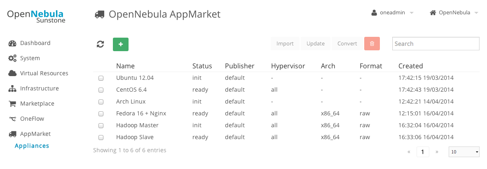
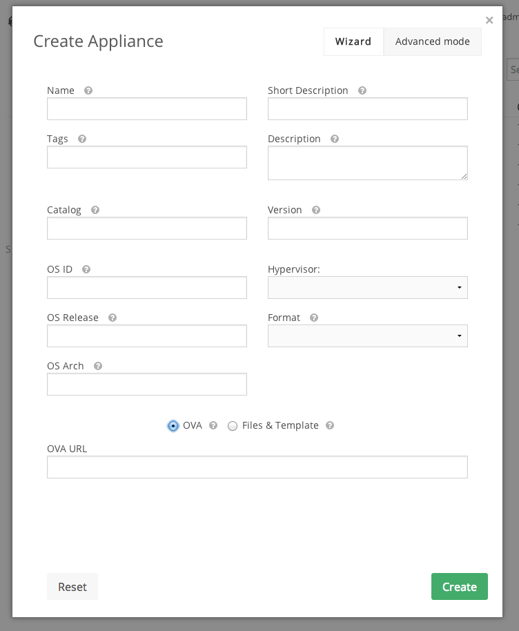
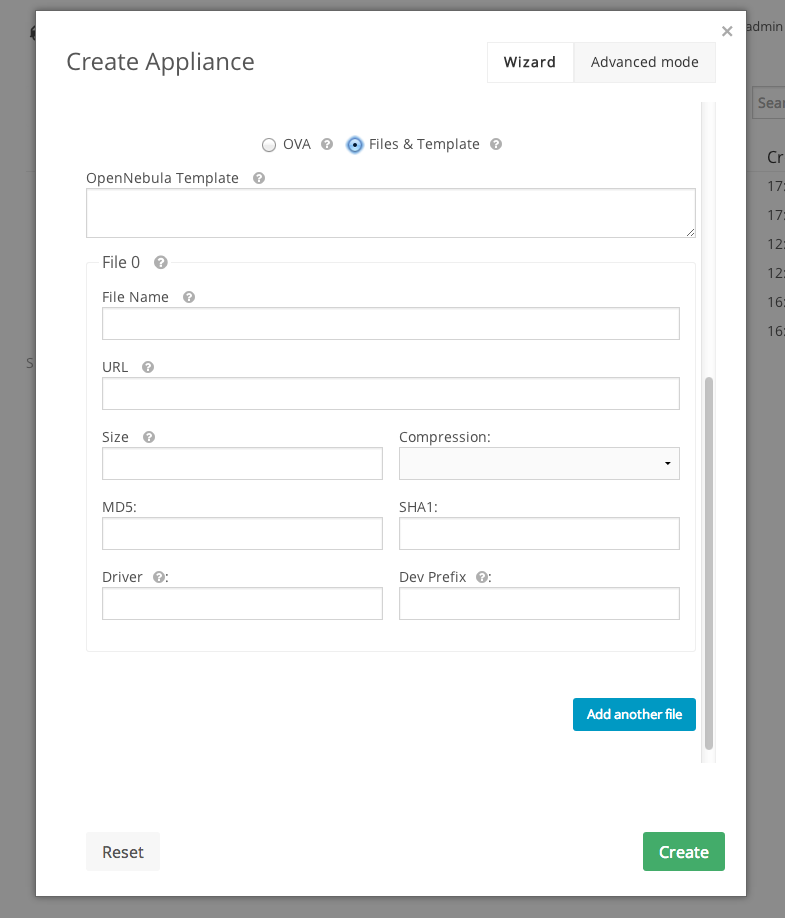
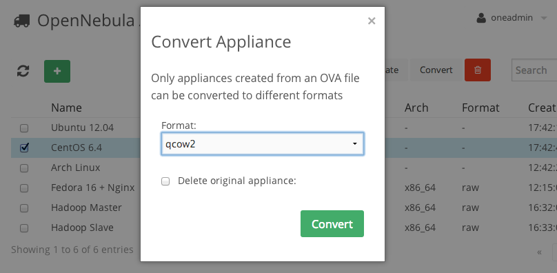
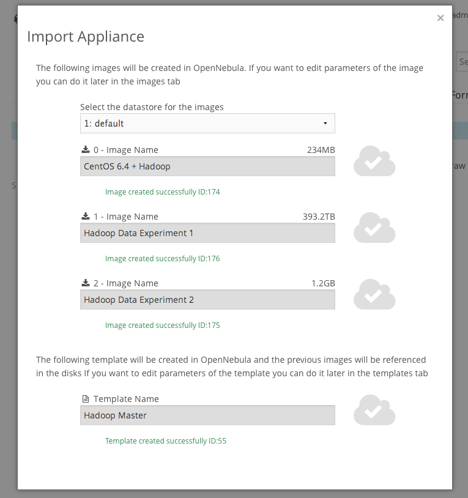
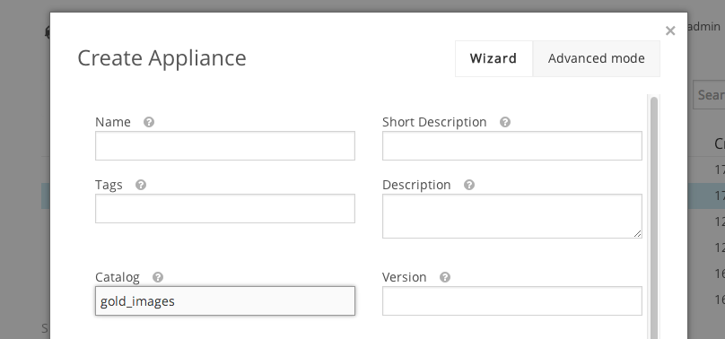

Using AppMarket
===============

AppMarket manages **Users** and **Appliances**. An OpenNebula Virtual Appliance is a pre-built software solution, consisting of a set of pre-configured virtual machine images and a template, ready-to-run on an OpenNebula cloud.

The AppMarket contains metadata that defines the Virtual Appliance but not the appliance files themselves. The metadata includes the links to download the appliance files from third-party servers.

AppMarket is integrated in Sunstone, both admin and users can interact with AppMarket from the AppMarket tab in Sunstone




Managing Appliances
-------------------

### Create an Appliance (ADMIN)

The appliances can be created in two different ways:

* Providing the URLs of the files and the OpenNebula template in the Appliance creation form. Note that the AppMarket contains metadata that defines the Virtual Appliance but not the appliance files themselves. The metadata includes the links to download the appliance files from third-party servers. The files will be only downloaded by OpenNebula and the AppMarket will not store any file.



* Providing an URL of an OVA file. In this case you will need the AppMarket Worker component that will download, unpack and generate the files URLs and OpenNebula template, instead of specifying them manually as in the previous case. If there is no AppWarket Worker, appliances created providing an OVA url will stay in the init status, and will not be available to be donwloaded.

Appliances created from an OVA file can be converted to different formats, including raw, qcow2 and vmdk.



You can also use the `appmarket` command to create a new appliance and providing the appliance in json:
```
$ appmarket create appliance.json
```

> Creating an appliances from an OVA file is only supported for admin users (defined by the role)

After sending the new appliance request, it will automatically included in the appliance list and all the users will be able to use it


### Manage Appliances (ADMIN)

Appliances can be edited or deleted by the owner or an Admin user after creation.


You can also use the ''appmarket'' command to list the existing appliances:
```
$ appmarket list
```

You can also use the ''appmarket'' command to update or delete an appliance:
```
$ appmarket update 39393939393
$ appmarket delete 39148302483
```

### Convert an Appliance (ADMIN)

Appliances that were created from an OVA file can be converted to different formats. Currently the supported formats are the following:

* raw
* qcow2
* vmdk

This operation can be performed through the AppMarket Sunstone tab using an admin account.



### Importing an Appliance from Sunstone (ADMIN/USER)

If you want to import a new appliance into your local infrastructure, you just have to select an appliance and click the''import'' button. A new dialog box will prompt you to create a new image for each file and the OpenNebula template if it is included in the appliance.



After that you will be able to use that image in a template in order to create a new instance.


Managing Users
--------------

Currently, the creation and management of AppMarket users is not available through the Sunstone GUI. You will have to use the CLI for this.

You can use the `appmarket-user` command to list, update, delete, enable/disable users:

    appmarket-user -u <admin_user> -p <admin_pass> list
    appmarket-user -u <admin_user> -p <admin_pass> enable 939393029039


To add a user to the AppMarket, first create a json file for the user **new_user.json**:

    {
        "username":     "new_user",
        "password":     "new_pass",
        "organization": "new_organization",
        "first_name":   "new_fuser",
        "last_name":    "new_luser",
        "website":      "new_wuser",
        "email":        "new_euser",
        "status":       "enabled",
        "role":         "user"
    }

You can  define the role for a given user. The available roles are:

* admin, will be able to manage all the appliances and users
* user, will be able to create new appliances and manage them
* worker (required for the AppMarket Worker)

The user can now be added to the AppMarket:

    appmarket-user create -u <admin_user> -p <admin_pass> new_user.json

The user that interacts with the AppMarket does not correspond with the OpenNebula user. This user account can be defined for **all the users of Sunstone** in the **/etc/one/sunstone-appmarket.conf**

    # AppMarket username and password
    # If no credentials are provided, an anonymous client will be used

    :appmarket_username:
    :appmarket_password:

Or you can define a **different account for each user** adding the APPMARKET_USER and APPMARKET_PASSWORD in the template of the user in OpenNebula.

If no account is provided in any of the two options, an annonymous account will be used and only the appliances in the community catalog (this is the catalog where the appliances are created by default) will be accessible. A user using an annonymous account will not be able to create new appliances, but she will be able to import existing ones into OpenNebula.


Catalogs, Filtering AppMarket Appliances
----------------------------------------------
You are able to filter visibility of Appliances to different Sunstone instances/users. While adding a new appliance specify catalog to which it will belong:



You can assign different catalogs for each user on creation or updating an existing one. This way users will be able to see public appliances and appliances that belong to catalogs which user has been granted access.

    {
        "username":     "new_user",
        "password":     "new_pass",
        "organization": "new_organization",
        "first_name":   "new_fuser",
        "last_name":    "new_luser",
        "website":      "new_wuser",
        "email":        "new_euser",
        "status":       "enabled",
        "role":         "user",
        "catalogs":     [
            "dev_appliances",
            "gold_images"
        ]
    }

To use different AppMarket account for each OpenNebula user or Sunstone instance, please check the previous section "Managing Users"

