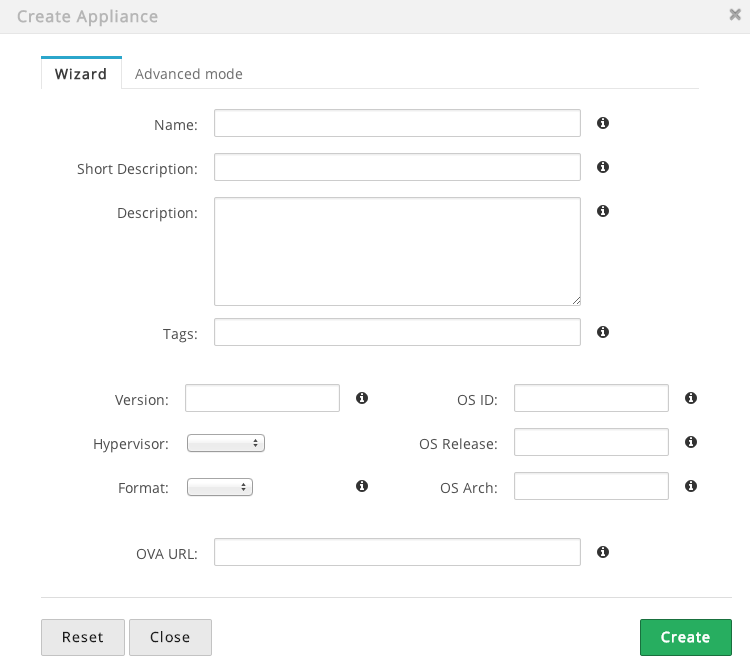

Using AppMarket
===============

AppMarket manages **Users** and **Appliances**. An OpenNebula Virtual Appliance is a pre-built software solution, consisting of a pre-configured virtual machine image and configuration information, ready-to-run on an OpenNebula cloud.

The AppMarket contains metadata that defines the Virtual Appliance but not the appliance files themselves. The metadata includes the links to download the appliance files from third-party servers.


Managing AppMarket
------------------

### Request an account (USER)

Users do not need to register to download public images. However they will need an App Developer account to post their Virtual Appliances. Users can get this account through the AppMarket GUI. This account is not enabled by default and it requires admin approval.

* Click on "Request Developer Access"


* Fill the form with the user information


You can also use the `appmarket-user` command to create a new user:
```
appmarket-user create user.json
```


### Manage Users (ADMIN)

An Admin user can manage the users of the Appmarket through the CLI, or clicking the following link in the main page:


From this view the Admin will be able to see all the existing users and enable/disble/update them as required, clicking in the more info button:


User accounts are not enabled by default and must be enabled from this page:


You can also use the `appmarket-user` command to list and enable users:
```
appmarket-user list
appmarket-user enable 939393029039
```

You can also define the role and catalogs for a given user. The available roles are:

* admin
* user
* worker (required for the AppMarket Worker)

### Create an Appliance (USER)

The appliances can be created in two different ways:

* Providing the URLs of the files and the OpenNebula template in the Appliance creation form.
* Providing an URL of an OVA file. In this case you will need the AppMarket Worker component that will download, unpack and generate the files URLs and OpenNebula template. If there is no AppWarket Worker, appliances created providing an OVA url will stay in the init status, and will not be available to be donwloaded. This method can only be used through the Sunstone tab and using an admin account.

After the user's developer account has been aproved, he will be able to include new appliances in the AppMarket by clicking the 'Create appliance' link:


A new dialog will prompt with the required fields to create a new appliance. Note that the AppMarket contains metadata that defines the Virtual Appliance but not the appliance files themselves. The metadata includes the links to download the appliance files from third-party servers.


You can also use the `appmarket` command to create a new appliance:
```
$ appmarket create appliance.json
```

From AppMarket 2.0 creating an appliance can be also done through the AppMarket tab in Sunstone.

> Creating an appliances from an OVA file is only supported through this method and only for admin users (defined by the role)




After sending the new appliance request, it will automatically included in the appliance list and all the users will be able to use it


### Manage Appliances (ADMIN)

Appliances can be edited or deleted by the owner or an Admin user after creation, in the appliance view.


You can also use the ''appmarket'' command to list the existing appliances:
```
$ appmarket list
```


You can also use the ''appmarket'' command to update or delete an appliance:
```
$ appmarket update 39393939393
$ appmarket delete 39148302483
```

### Convert an Appliance (ADMIN)

Appliances that were created from an OVA file can be converted to different formats. Currently the supported formats are the following:

* raw
* qcow2
* vmdk

This operation can be performed through the AppMarket Sunstone tab using an admin account.

### Importing an Appliance from Sunstone

Sunstone includes a new tab that allows OpenNebula users to interact with the AppMarket:


If you want to import a new appliance into your local infrastructure, you just have to select an image and click the''import'' button. A new dialog box will prompt you to create a new image for each file and the OpenNebula template if it is included in the appliance.


After that you will be able to use that image in a template in order to create a new instance.


Filtering AppMarket by user permissions
----------------------------------------------
You are able to filter visibility of Appliances to different Sunstone instances. While adding a new appliance specify catalog to which it will belong:


If you already have a developer account in AppMarket you should set these credentials in sunstone-server.conf:

```
# Marketplace username and password
# If no credentials are provided, an anonymous client will be used
#
:marketplace_username: test
:marketplace_password: password
```

Then in AppMarket 'Manage Users' tab add names of catalogs that user should have access to.


This way users will be able to see public appliances and appliances that belong to catalogs which user has been granted access.
