Using AppMarket
===============

AppMarket manages **Users** and **Appliances**. An OpenNebula Virtual Appliance is a pre-built software solution, consisting of a pre-configured virtual machine image and configuration information, ready-to-run on an OpenNebula cloud.

The AppMarket contains metadata that defines the Virtual Appliance but not the appliance files themselves. The metadata includes the links to download the appliance files from third-party servers.

Managing AppMarket
------------------

### Request an account (USER)

Users do not need to register to download public images. However they will need an App Developer account to post their Virtual Appliances. Users can get this account through the AppMarket GUI. This account is not enabled by default and it requires admin approval.

* Click on "Request Developer Access"

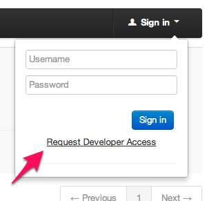

* Fill the form with the user information

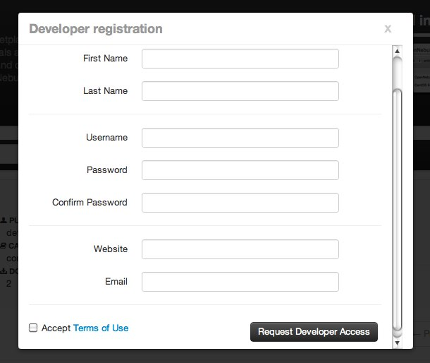

You can also use the `appmarket-user` command to create a new user:
```
appmarket-user create user.json
```


### Manage Users (ADMIN)

An Admin user can manage the users of the Appmarket through the CLI, clicking the following link in the main page:
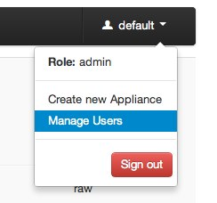

From this view the Admin will be able to see all the existing users and enable/disble/update them as required, clicking in the more info button:


User accounts are not enabled by default and must be enabled from this page:

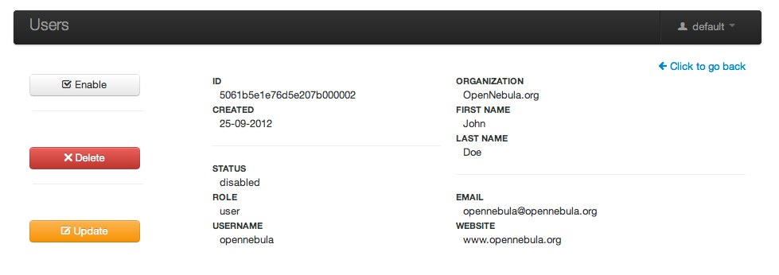

You can also use the `appmarket-user` command to list and enable users:
```
appmarket-user list
appmarket-user enable 939393029039
```

### Create an Appliance (USER)

After the user's developer account has been aproved, he will be able to include new appliances in the AppMarket by clicking the 'Create appliance' link:

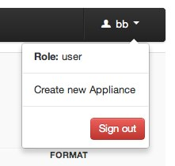

A new dialog will prompt with the required fields to create a new appliance. Note that the AppMarket contains metadata that defines the Virtual Appliance but not the appliance files themselves. The metadata includes the links to download the appliance files from third-party servers.

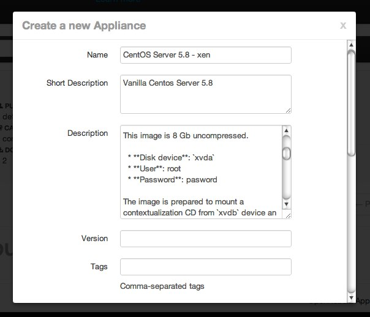

You can also use the `appmarket` command to create a new appliance:
```
$ appmarket create appliance.json
```

After sending the new appliance request, it will automatically included in the appliance list and all the users will be able to use it


### Manage Appliances (ADMIN)

Appliances can be edited or deleted by the owner or an Admin user after creation, in the appliance view.

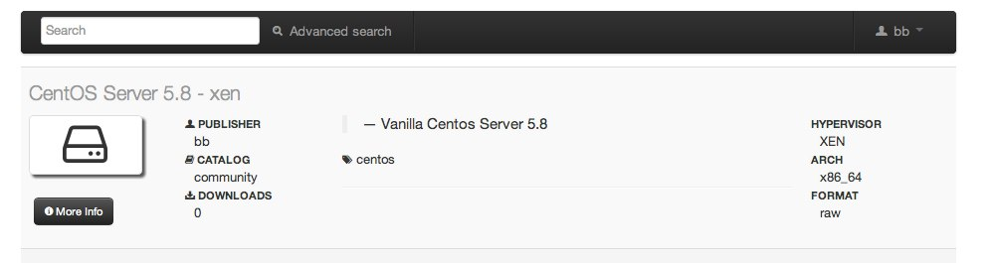

You can also use the ''appmarket'' command to list the existing appliances:
```
$ appmarket list
```

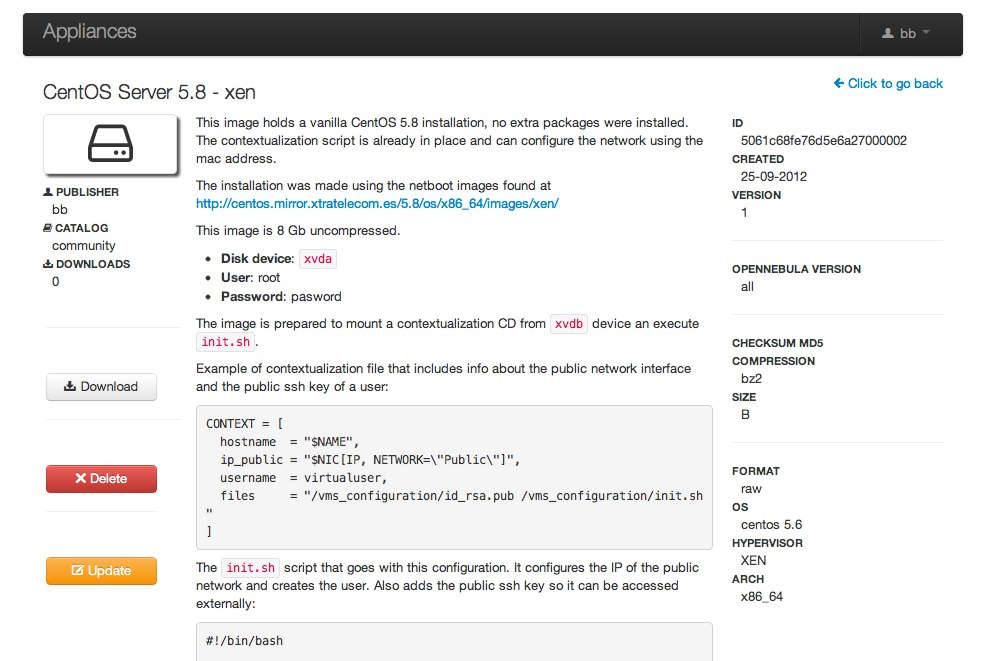

You can also use the ''appmarket'' command to update or delete an appliance:
```
$ appmarket update 39393939393
$ appmarket delete 39148302483
```

Interacting with the AppMarket from OpenNebula
----------------------------------------------

You can import appliances from the AppMarket to OpenNebula through Sunstone or using the command cli ''onemarket'' provided with OpenNebula.


### Using Susntone

Sunstone includes a new tab that allows OpenNebula users to interact with the AppMarket:

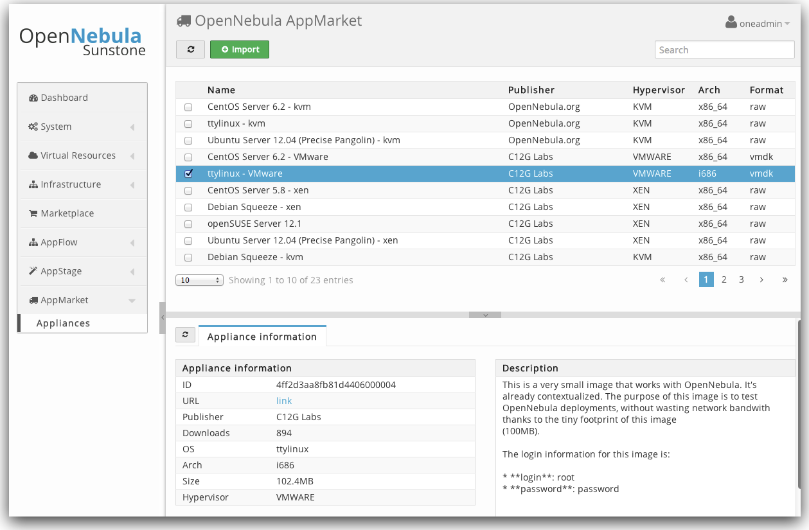

If you want to import a new appliance into your local infrastructure, you just have to select an image and click the''import'' button. A new dialog box will prompt you to create a new image.

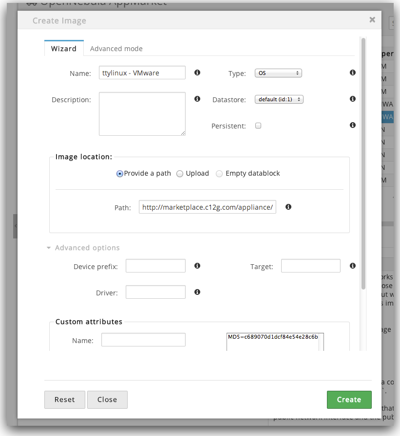

After that you will be able to use that image in a template in order to create a new instance.


### Using the CLI

You can also use the CLI to interact with the AppMarket:

* List appliances:
```
$ onemarket list --server http://appmarket.opennebula.com
                       ID                                               NAME       PUBLISHER
 4fc76a938fb81d3517000001         Ubuntu Server 12.04 LTS (Precise Pangolin)  OpenNebula.org
 4fc76a938fb81d3517000002                                         CentOS 6.2  OpenNebula.org
 4fc76a938fb81d3517000003                                           ttylinux  OpenNebula.org
 4fc76a938fb81d3517000004                    OpenNebula Sandbox VMware 3.4.1       C12G Labs
 4fcf5d0a8fb81d1bb8000001                       OpenNebula Sandbox KVM 3.4.1       C12G Labs
```

* Show an appliance:
```
$ onemarket show 4fc76a938fb81d3517000004 --server http://appmarket.opennebula.com
{
    "_id": {"$oid": "4fc76a938fb81d3517000004"},
    "catalog": "public",
    "description": "This image is meant to be run on a ESX hypervisor, and comes with a preconfigured OpenNebula 3.4.1, ready to manage a ESX farm. Several resources are created within OpenNebula (images, virtual networks, VM templates) to build a pilot cloud under 30 minutes.\n\nMore information can be found on the <a href=\"http://opennebula.org/cloud:sandbox:vmware\">OpenNebula Sandbox: VMware-based OpenNebula Cloud guide</a>.\n\nThe login information for this VM is\n\nlogin: root\npassword: opennebula",
    "downloads": 90,
    "files": [
        {
            "type": "OS",
            "hypervisor": "ESX",
            "format": "VMDK",
            "size": 693729120,
            "compression": "gzip",
            "os-id": "CentOS",
            "os-release": "6.2",
            "os-arch": "x86_64",
            "checksum": {
              "md5": "2dba351902bffb4716168f3693e932e2"
            }
        }
    ],
    "logo": "/img/logos/view_dashboard.png",
    "name": "OpenNebula Sandbox VMware 3.4.1",
    "opennebula_template": "",
    "opennebula_version": "",
    "publisher": "C12G Labs",
    "tags": [
        "linux",
        "vmware",
        "sandbox",
        "esx",
        "frontend"
    ],
    "links": {
        "download": {
            "href": " http://appmarket.opennebula.com /appliance/4fc76a938fb81d3517000004/download"
        }
    }
}
```


* Create a new image: You can use the download link as PATH in a new Image template to create am Image.

```
$ onemarket show 4fc76a938fb81d3517000004 --server  http://appmarket.opennebula.com
{
    ...
      "links": {
        "download": {
            "href": "http://marketplace.c12g.com/appliance/4fc76a938fb81d3517000004/download"
        }
    }
}

$ cat marketplace_image.one
NAME          = "OpenNebula Sandbox VMware 3.4.1"
PATH          =  http://appmarket.opennebula.com /appliance/4fc76a938fb81d3517000004/download
TYPE          = OS

$ oneimage create marketplace_image.one
ID: 1231
```

Filtering AppMarket by user permissions
----------------------------------------------
You are able to filter visibility of Appliances to different Sunstone instances. While adding a new appliance specify catalog to which it will belong:


If you already have a developer account in AppMarket you should set these credentials in sunstone-server.conf:

```
# Marketplace username and password
# If no credentials are provided, an anonymous client will be used
#
:marketplace_username: username
:marketplace_password: password
```

Then in AppMarket 'Manage Users' tab add names of catalogs that user should have access to. 

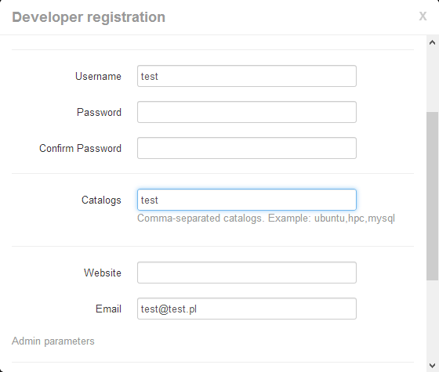

This way users will be able to see public appliances and appliances that belong to catalogs which user has been granted access.